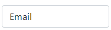

# @tkrotoff/bootstrap-floating-label

[](https://www.npmjs.com/package/@tkrotoff/bootstrap-floating-label)
[](https://github.com/tkrotoff/bootstrap-floating-label/actions)
[](https://github.com/prettier/prettier)
[](https://github.com/airbnb/javascript)

Floating label for Bootstrap 5



Example: https://codesandbox.io/s/github/tkrotoff/bootstrap-floating-label/tree/codesandbox.io

- Small: less than 200 lines of [SCSS](src/bootstrap-floating-label.scss)
- Works with modern browsers
- Works with any font family and size
- Uses [Bootstrap variables](https://getbootstrap.com/docs/5.0/customize/sass/#variable-defaults)

⚠️ Latest implementation for Bootstrap 4 is [@tkrotoff/bootstrap-floating-label v0.8](https://github.com/tkrotoff/bootstrap-floating-label/tree/v0.8.0)

The Nielsen Norman Group talks about ["Placeholders and Floating Labels disadvantages"](https://www.nngroup.com/articles/form-design-placeholders/)

## Usage

`npm install @tkrotoff/bootstrap-floating-label`

Import [bootstrap-floating-label.scss](src/bootstrap-floating-label.scss) after bootstrap.scss:

```SCSS
@import '~bootstrap/scss/bootstrap';

@import '~@tkrotoff/bootstrap-floating-label/src/bootstrap-floating-label';
```

Place `<label>` under `<input>` inside your [Bootstrap code](https://getbootstrap.com/docs/5.0/forms/overview/):

```HTML
<div class="floating-label">
  <input type="email" id="email" class="form-control" placeholder="name@example.com">
  <label for="email">Email</label>
</div>
```

## Limitations

There is no good way to [detect if the user entered text inside an input using CSS](https://stackoverflow.com/q/16952526).

Thus a placeholder is required `<input placeholder=" ">` otherwise the label will be above the input instead of inside (see https://codepen.io/tkrotoff/pen/KjgyZj).
